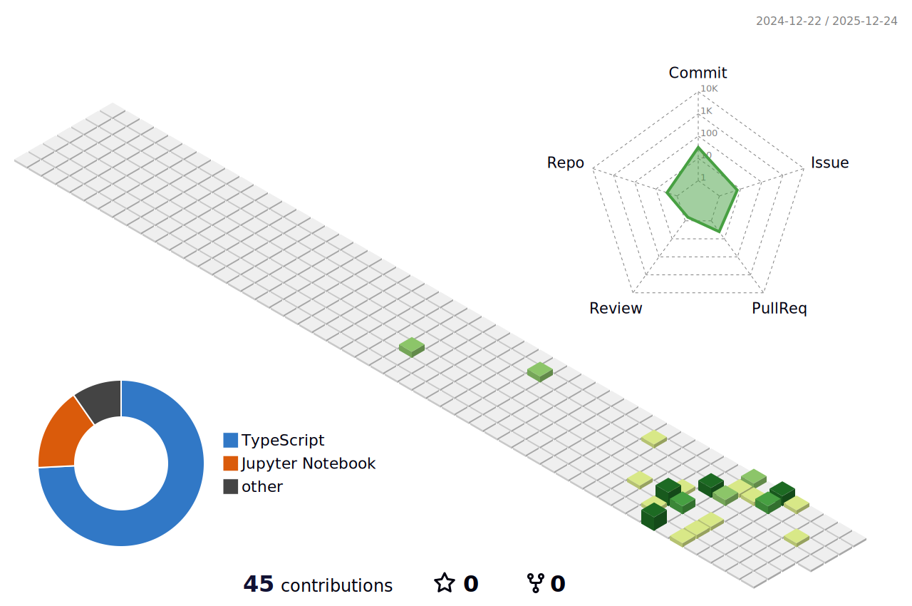

<div align="center">

  

  

  <div align="center">
    
  </div>

</div>

---

<div align="center">

  ## 🚀 About Me

  

  <br/>

  I'm an **AI Developer** passionate about learning and developing cutting-edge AI solutions to solve real-world problems. I thrive on exploring the latest technologies, building intelligent systems, and contributing to the AI community. My journey involves continuous learning, experimentation, and turning complex challenges into elegant solutions.

  <br/>

  - 🔭 I'm currently working on **AI/ML projects** and exploring new technologies
  - 🌱 I'm learning **Advanced Machine Learning**, **Deep Learning**, and **AI Ethics**
  - 👯 I'm looking to collaborate on **Open Source AI Projects**
  - 💬 Ask me about **AI**, **Machine Learning**, **Python**, or **Web Development**
  - 📫 How to reach me: [Your Email/Contact]
  - ⚡ Fun fact: I believe AI can transform the world for the better!

</div>

---

<div align="center">

  ## 🛠️ Tech Stack & Skills

  <br/>

  ### Programming Languages & Experience Levels

  <br/>

  **Python** - Level 9/10
  `█████████░` 90% ⭐⭐⭐⭐⭐⭐⭐⭐⭐

  **JavaScript** - Level 8/10
  `████████░░` 80% ⭐⭐⭐⭐⭐⭐⭐⭐

  **HTML & CSS** - Level 8/10
  `████████░░` 80% ⭐⭐⭐⭐⭐⭐⭐⭐

  **TypeScript** - Level 7.5/10
  `███████░░░` 75% ⭐⭐⭐⭐⭐⭐⭐

  **Java** - Level 7/10
  `███████░░░` 70% ⭐⭐⭐⭐⭐⭐⭐

  **C++** - Level 6.5/10
  `██████░░░░` 65% ⭐⭐⭐⭐⭐⭐

  <br/>

  <details>
  <summary><b>📊 Detailed Skills Breakdown</b></summary>

  ```text
  Python          ████████████████████░░░░░░░░░░  90%  Level 9
  JavaScript      ██████████████████░░░░░░░░░░░░  80%  Level 8
  HTML & CSS      ██████████████████░░░░░░░░░░░░  80%  Level 8
  TypeScript      ████████████████░░░░░░░░░░░░░░  75%  Level 7.5
  Java            ███████████████░░░░░░░░░░░░░░░  70%  Level 7
  C++             ██████████████░░░░░░░░░░░░░░░░  65%  Level 6.5
  SQL             ██████████████░░░░░░░░░░░░░░░░  65%  Level 6.5
  React           ████████████████░░░░░░░░░░░░░░  75%  Level 7.5
  Node.js         ████████████████░░░░░░░░░░░░░░  75%  Level 7.5
  ```

  </details>

  <br/>

  ### AI/ML Technologies

  <p align="center">
    
    
    
    
    
    
    
  </p>

  ### Frameworks & Tools

  <p align="center">
    
    
    
    
    
    
    
    
    
  </p>

</div>

---

<div align="center">

  ## 📊 GitHub Stats & Activity

  <br/>

  <div align="center">
    
    
  </div>

  <br/>

  

  <br/>

  ## 🎨 3D Contribution Graph

  <p align="center">
    
  </p>

  <sub>💡 *This 3D visualization reflects my GitHub contribution activity. The graph updates automatically based on my commits!*</sub>

</div>

---

<div align="center">

  ## 🔥 Current Focus

  <br/>

  <p align="center">
    
  </p>

  <br/>

  - 🎯 Developing **Machine Learning Models** for real-world applications
  - 🔬 Researching **Neural Networks** and **Deep Learning** architectures
  - 💻 Building **AI-powered Web Applications**
  - 📚 Contributing to **Open Source AI Projects**
  - 🌟 Creating **Innovative Solutions** that make a difference

</div>

---

<div align="center">

  ## 🏆 Achievements & Highlights

  <br/>

  <p align="center">
    
  </p>

</div>

---

<div align="center">

  ## 📈 Contribution Metrics

  <br/>

  <div align="center">
    
  </div>

</div>

---

<div align="center">

  ## 🤝 Connect With Me

  <br/>

  <p align="center">
    <a href="https://github.com/Yousif2326" target="_blank">
      
    </a>
    <a href="https://linkedin.com/in/yourprofile" target="_blank">
      
    </a>
    <a href="https://twitter.com/yourhandle" target="_blank">
      
    </a>
    <a href="mailto:your.email@example.com" target="_blank">
      
    </a>
  </p>

</div>

---

<div align="center">

  ## 💡 Random Dev Quote

  <br/>

  <p align="center">
    
  </p>

</div>

---

<div align="center">

  

  <p align="center">
    
  </p>

  <p align="center">
    Made with ❤️ by <b>Yousif Salman</b>
  </p>

</div>
